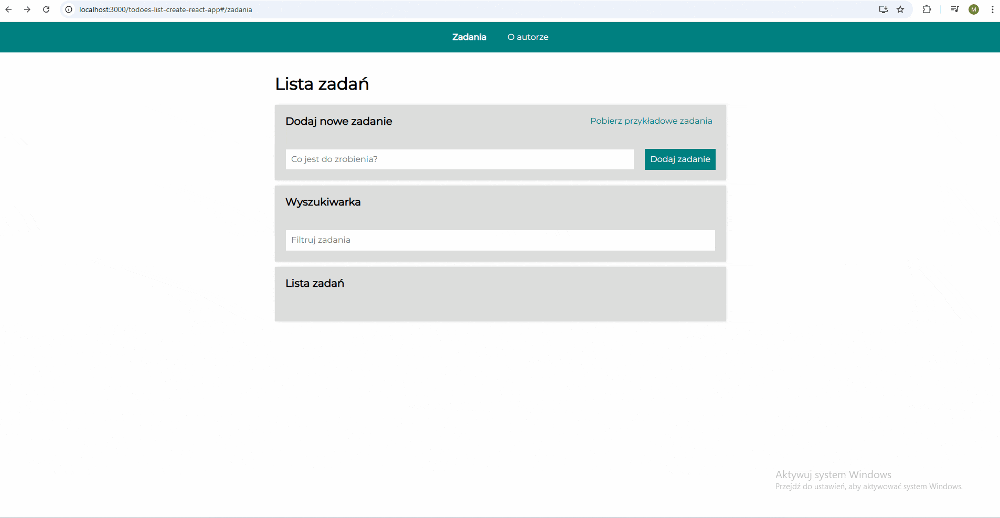
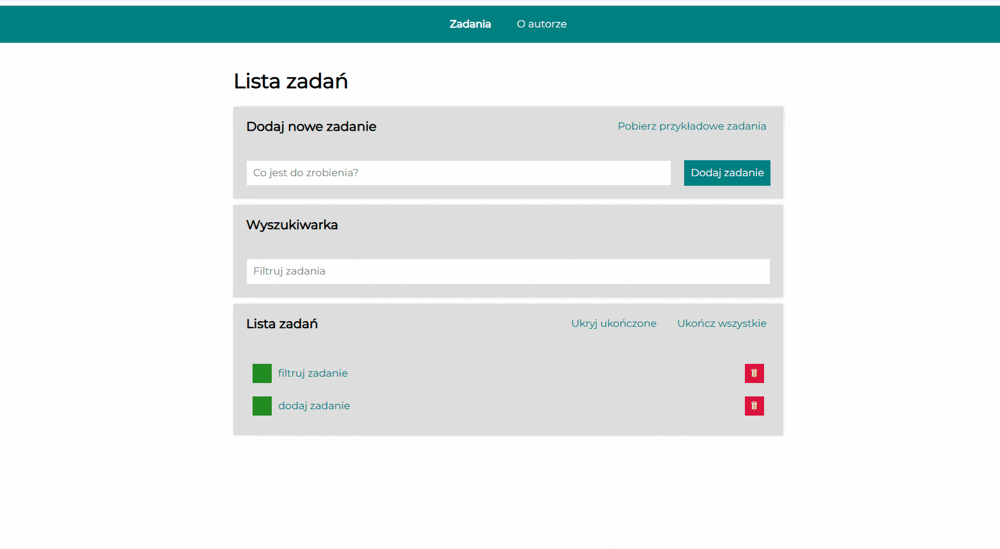

# To-do list

screenshot

## Table of contents

- [Description](#description)
- [technologies](#technologies-used)
- [Features](#features)
- [Demo](#demo)

## Description

✅ **To-do List**

A simple, fully functional web app built in **React** for efficiently managing daily tasks.  
The app stores state in the browser's memory, ensuring **task persistence** even after reloading the page.

The project demonstrates modern front-end architecture and asynchronous state management techniques using **Redux Toolkit** and **Redux-Saga**.

## Technologies used

- ⚛️ **React** – component-based UI library
- 🧠 **Redux Toolkit** – modern and simplified state management
- 🌀 **Redux-Saga** – handling side effects and asynchronous logic
- 🌐 **React Router** – managing navigation between app views
- 💾 **localStorage** – - Persistent State: All tasks are automatically saved to the browser's localStorage thanks to the logic implemented in the hook.
- 🧩 **styled-components** – CSS-in-JS for modular and maintainable styling
- Normalize **CSS** included [CSS](https://cdnjs.com/libraries/normalize)

## Features

- ✅ **Persistent State:** All tasks are automatically saved to `localStorage` using Redux logic.
- ⚡ **Asynchronous Example Tasks:** Users can fetch example tasks via an **asynchronous Saga call** that simulates an API request.  
  This demonstrates practical usage of **Redux-Saga** for side effects and async data fetching.
- 🗂️ **Filtering:** Ability to hide completed tasks with a toggle.
- 🗑️ **Deleting Tasks:** Functionality to remove individual items.
- 🟩 **Bulk Actions:** Button to mark all tasks as complete or hide completed ones.
- 🎨 **Responsive Design:** Fully optimized for mobile and desktop.
- 🧭 **Routing:** Application includes navigation using **React Router** – for example, the "Tasks" and "About author" sections.

## Why this project?

This app showcases not only fundamental React knowledge but also:
- understanding of **Redux architecture** (actions, reducers, selectors),
- implementation of **asynchronous workflows** with Redux-Saga,
- clean and reusable **component structure**,
- practical use of **theme and breakpoints** for styling.

It’s designed to demonstrate the ability to build scalable, real-world React applications that are both **performant** and **maintainable**.

## Demo

Visit my website here: [Demo](https://maciekinit.github.io/todoes-list-create-react-app/)

# Getting Started with Create React App

This project was bootstrapped with [Create React App](https://github.com/facebook/create-react-app).

## Available Scripts

In the project directory, you can run:

### `npm start`

Runs the app in the development mode.\
Open [http://localhost:3000](http://localhost:3000) to view it in your browser.

The page will reload when you make changes.\
You may also see any lint errors in the console.

### `npm run build`

Builds the app for production to the `build` folder.\
It correctly bundles React in production mode and optimizes the build for the best performance.

The build is minified and the filenames include the hashes.\
Your app is ready to be deployed!

See the section about [deployment](https://facebook.github.io/create-react-app/docs/deployment) for more information.

## Learn More

You can learn more in the [Create React App documentation](https://facebook.github.io/create-react-app/docs/getting-started).

To learn React, check out the [React documentation](https://reactjs.org/).

### Code Splitting

This section has moved here: [https://facebook.github.io/create-react-app/docs/code-splitting](https://facebook.github.io/create-react-app/docs/code-splitting)

### Analyzing the Bundle Size

This section has moved here: [https://facebook.github.io/create-react-app/docs/analyzing-the-bundle-size](https://facebook.github.io/create-react-app/docs/analyzing-the-bundle-size)

### Making a Progressive Web App

This section has moved here: [https://facebook.github.io/create-react-app/docs/making-a-progressive-web-app](https://facebook.github.io/create-react-app/docs/making-a-progressive-web-app)

### Advanced Configuration

This section has moved here: [https://facebook.github.io/create-react-app/docs/advanced-configuration](https://facebook.github.io/create-react-app/docs/advanced-configuration)

### Deployment

This section has moved here: [https://facebook.github.io/create-react-app/docs/deployment](https://facebook.github.io/create-react-app/docs/deployment)

### `npm run build` fails to minify

This section has moved here: [https://facebook.github.io/create-react-app/docs/troubleshooting#npm-run-build-fails-to-minify](https://facebook.github.io/create-react-app/docs/troubleshooting#npm-run-build-fails-to-minify)
